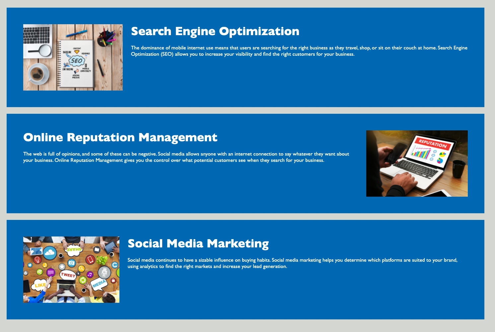

# Dan-Smith-Horiseon-HTML-and-CSS-Code-Refactor

**Description**

In this project I was asked by marketing agency to refactor their website's code to follow accessibility standards in order for their site to be optimized for search engines.

To acheive this outcome for the client there were several changes I had to make. These included:
- Replacing all div elements with class names to more descriptive semantic HTML elements
- Refactor all CSS code to include these new HTML elements as to not change the site's appearance 
- Adding alt attributes to all img elements to describe the images for those using screen readers

In order to go above and beyone the clients expectations I also:
- Fixed a bug in their site to make the website's navigation bar function as expected
- Made clear comments about the code in both HTML and CSS files
- Refacrored the CSS where there was a lot of code being repeated for similar styled elements to ensure future changes will be more efficient
- Rewrote the title attribute for the webpage to be more descriptive

**Mockup Website Link**

Website link:
https://dansmith09.github.io/Dan-Smith-Horiseon-HTML-and-CSS-Code-Refactor/#online-reputation-management

**Website Section Screenshots**

To implement new semantic HTML elements the previous div elements were renamed. Their code was rewritten to ensure the website still appeared the same as the original source code. Below are the new elements:

- Header and Nav

- Main

- Aside

- Footer

